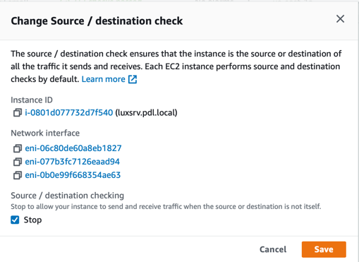

**Change Source / destination check**



```
yum install iptables-services -y
systemctl enable iptables
systemctl start iptables

iptables -t nat -A POSTROUTING -o eth0 -j MASQUERADE
iptables -t nat -A PREROUTING -i eth0 -p tcp -m multiport --dport 3389,23389 -j DNAT --to-destination 10.0.1.101
iptables -t nat -A PREROUTING -i eth0 -p tcp -m multiport --dport 3390,23390 -j DNAT --to-destination 10.0.1.101
iptables -t nat -A PREROUTING -i eth0 -p tcp -m multiport --dport 80,443,2222 -j DNAT --to-destination 10.0.2.101
iptables -t nat -A PREROUTING -i eth0 -p tcp -m multiport --dport 8080,8443,22222 -j DNAT --to-destination 10.0.2.102

sudo iptables -F

service iptables save
```


https://access.redhat.com/documentation/en-us/red_hat_enterprise_linux/8/html/deploying_different_types_of_servers/assembly_configuring-and-managing-a-bind-dns-server_deploying-different-types-of-servers


https://help.ubuntu.com/community/BIND9ServerHowto


debcli.enta.pt
```
cd /etc/netplan/
nano 50-cloud-init.yaml 

root@debcli:~# cat /etc/netplan/50-cloud-init.yaml 
# This file is generated from information provided by the datasource.  Changes
# to it will not persist across an instance reboot.  To disable cloud-init's
# network configuration capabilities, write a file
# /etc/cloud/cloud.cfg.d/99-disable-network-config.cfg with the following:
# network: {config: disabled}
network:
    ethernets:
        eth0:
            dhcp4: true
            dhcp6: false
            dhcp4-overrides:
                use-dns: false
            routes:
              - to: 0.0.0.0/0
                via: 10.0.1.100
                on-link: true
            nameservers:
                search: [pdl.local]
                addresses: [10.0.1.100]
            match:
                macaddress: 12:de:01:67:38:71
            set-name: eth0
    version: 2
root@debcli:~# 


netplan try
sudo apt install -y xfce4 xfce4-goodies
sudo apt install -y xrdp filezilla 
snap install mysql-workbench-community
snap connect mysql-workbench-community:password-manager-service :password-manager-service
snap install brave
snap install thunderbird
sudo adduser xrdp ssl-cert
passwd ubuntu
echo xfce4-session > /home/ubuntu/.xsession
chown ubuntu:ubuntu /home/ubuntu/.xsession
sudo systemctl enable --now xrdp

# Goto GUI and download Zoiper5; come back here and install

dpkg -i /home/ubuntu/Downloads/Zoiper5_5.5.14_x86_64.deb 
   
```

rhcli.pdl.local

```
    1  sudo yum -y update
    2  sudo yum install -y amazon-linux-extras
    3  sudo amazon-linux-extras enable mate-desktop1.x
    4  yum clean metadata
    5  yum install mesa-dri-drivers dejavu-sans-fonts dejavu-sans-mono-fonts dejavu-serif-fonts mate-session-manager mate-panel marco caja mate-terminal
    6  nano /etc/sysconfig/network-scripts/ifcfg-eth0
    7  ping 1.1.1.1
    8  systemctl restart network
    9  ping 1.1.1.1
   10  sudo amazon-linux-extras enable firefox
   11  yum clean metadata
   12  yum install firefox
   13  sudo amazon-linux-extras enable epel
   14  yum clean metadata
   15  yum install epel-release
   16  yum install filezilla xrdp
   17  systemctl enable --now xrdp
   18  systemctl status  xrdp
   19  passwd ec2-user
   20  echo "/usr/bin/mate-session" > /home/ec2-user/.Xclients && chmod +x /home/ec2-user/.Xclients && chown ec2-user:ec2-user /home/ec2-user/.Xclients
   21  ls -l /home/ec2-user/.Xclients
   22  reboot
```

Entrar no GUI e fazer o download do Zoiper5 

Ir para o terminal, mudar para a pasta Downloads, e correr:

```
sudo yum install Zoiper5_5.5.14_x86_64.rpm
```
